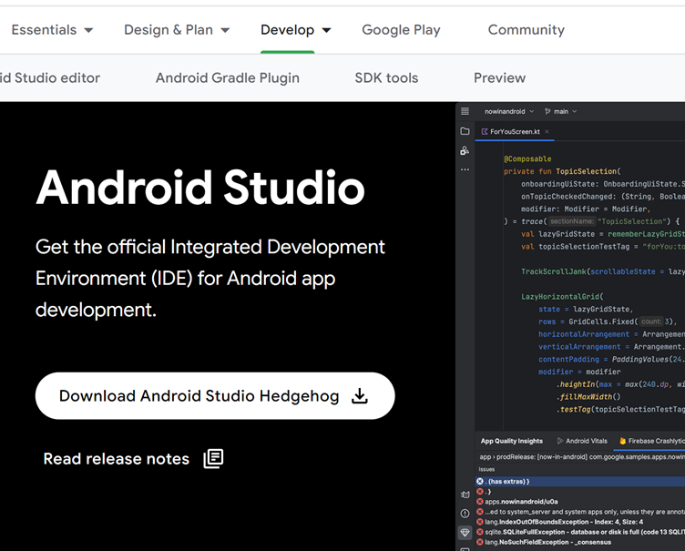
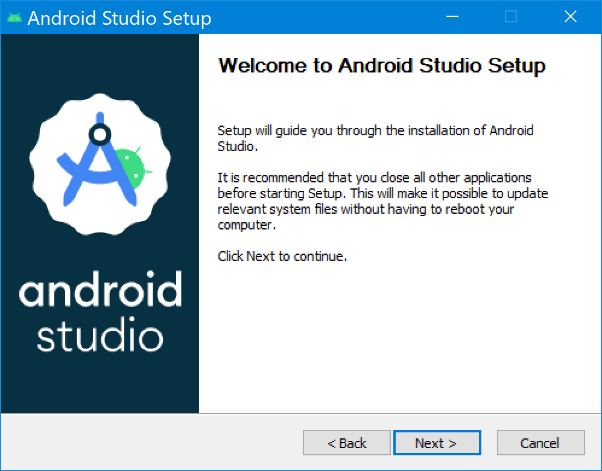
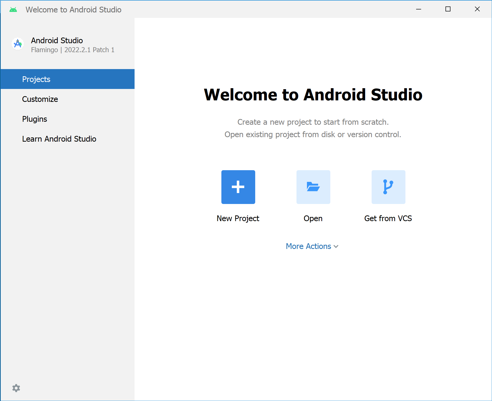
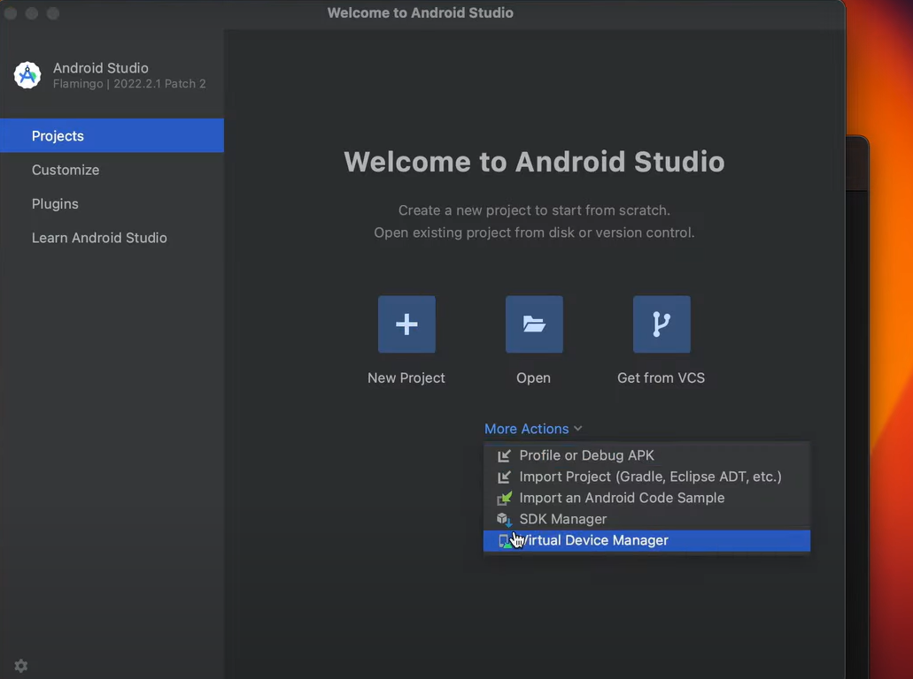
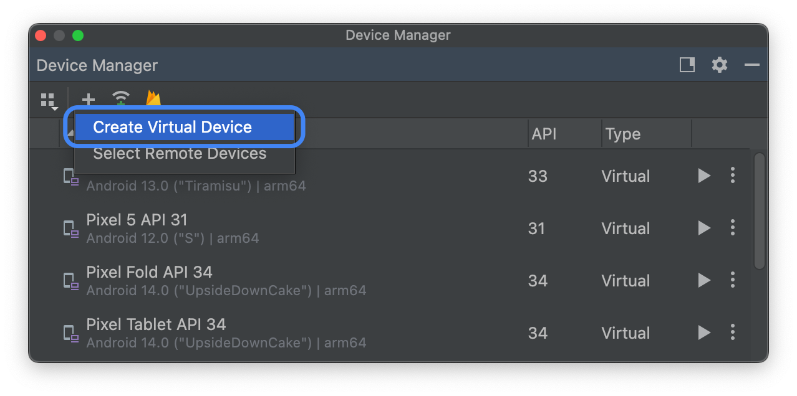

# Tutorial: Instalación de Android Studio

   

## 1. Instalación de Android Studio

### Paso 1: Descargar Android Studio

1. Ve al sitio oficial de Android Studio: [https://developer.android.com/studio](https://developer.android.com/studio)
2. Descarga el instalador correspondiente a tu sistema operativo (Windows, macOS o Linux).

### Paso 2: Instalar Android Studio

1. Ejecuta el archivo descargado y sigue las instrucciones del asistente de instalación.
2. Acepta los términos y condiciones de la licencia.
3. Selecciona los componentes que deseas instalar (por defecto, se selecciona Android SDK, emulador y la máquina virtual).
4. Haz clic en `Instalar` y espera a que se complete el proceso.
5. Una vez instalado, abre Android Studio.

### Paso 3: Configurar Android Studio por Primera Vez

1. Al abrir Android Studio, aparecerá el asistente de configuración. Haz clic en `Next` para proceder.
2. Selecciona el tipo de instalación (recomendado es la opción `Standard`).
3. Confirma que quieres descargar el SDK y el emulador.
4. Finaliza el proceso de configuración y Android Studio estará listo para usarse.

---

## 2. Agregar nuevo dispositivo

### Paso 1: Abrir el AVD Manager

1. Abre Android Studio.
2. Haz clic en `Tools` en la barra superior y selecciona `AVD Manager` (Android Virtual Device Manager).

### Paso 2: Crear un Nuevo Dispositivo Virtual

1. En el AVD Manager, haz clic en `Create Virtual Device`.
2. Selecciona un dispositivo de la lista (puedes elegir un dispositivo como Pixel 2 o cualquier otro).
3. Haz clic en `Next`.

### Paso 3: Seleccionar la Imagen del Sistema

1. En la pantalla de "System Image", selecciona la pestaña `Other Images`.
2. Busca y selecciona `Google Pixel 8`.
   - Si no lo tienes descargado, haz clic en el icono de descarga junto a Google API 7 para obtenerlo.
3. Haz clic en `Next`.

### Paso 4: Configurar las Opciones del Emulador

1. En la pantalla de "AVD Configuration", puedes ajustar los parámetros del dispositivo virtual como:
   - **Nombre del AVD**: Un nombre descriptivo para tu dispositivo virtual.
   - **Tamaño de la RAM**: Dependiendo de tu sistema, ajusta la cantidad de RAM si es necesario.
   - **Otras opciones**: Puedes dejar las opciones por defecto si no requieres cambios.
2. Haz clic en `Finish`.

### Paso 5: Ejecutar el Emulador

1. En el AVD Manager, verás tu nuevo dispositivo virtual creado. Haz clic en el icono `Play` para iniciar el emulador.
2. Android Studio abrirá el emulador con Google Pixel 8.

---

## Recursos adicionales:

- [Documentación oficial de Android Studio](https://developer.android.com/studio/intro)
- [SDK Manager en Android Studio](https://developer.android.com/studio/intro/update)
