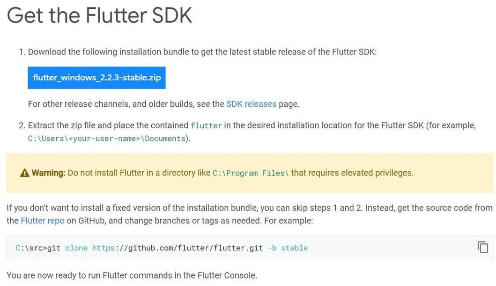

# Tutorial de Instalación del Flutter SDK en Windows

<div style="text-align: center;">
   
</div>

## Requisitos Previos

- Sistema operativo Windows 7 SP1 o posterior (64 bits).
- Git para Windows.

## Paso 1: Descargar el Flutter SDK

1. Visita la página oficial de Flutter: [Flutter SDK](https://flutter.dev/docs/get-started/install/windows).



2. Haz clic en el enlace para descargar el archivo ZIP del SDK.

## Paso 2: Extraer el SDK

1. Crea una carpeta en `C:\` llamada `flutter`.
2. Extrae el contenido del archivo ZIP descargado en `C:\flutter`.

## Paso 3: Agregar Flutter a la Variable de Entorno PATH

1. Haz clic derecho en "Este PC" o "Mi PC" y selecciona "Propiedades".
2. Haz clic en "Configuración avanzada del sistema".
3. En la barra de búsqueda, haz clic en el botón "Variables de entorno para esta cuenta".


4. En el menu, busca la variable `Path` y selecciona "Editar".
5. Haz clic en "Nuevo" y agrega la ruta `C:\flutter\bin`.
6. Haz clic en "Aceptar" para cerrar todas las ventanas.

## Paso 4: Verificar la Instalación

1. Abre una nueva ventana de la línea de comandos (cmd).
2. Escribe el siguiente comando y presiona Enter:

```bash
flutter doctor
```

## Paso 5: Aceptar las Licencias

Después de instalar el Flutter SDK, es necesario aceptar las licencias de Android SDK para poder desarrollar aplicaciones Android con Flutter.

1. Abre Android Studio.

En la ventana de bienvenida de Android Studio, haz clic en "Configure" y selecciona "SDK Manager".

1. En la pestaña "SDK Platforms", asegúrate de que la casilla "Show Package Details" esté marcada.
2. Expande "Android 12.0 (S)" y asegúrate de que las siguientes opciones estén seleccionadas:
   - Android SDK Platform 31
   - Intel x86 Atom_64 System Image o Google APIs Intel x86 Atom System Image
3. Haz clic en "Apply" para descargar e instalar los componentes seleccionados.

En la línea de comandos, navega a la ubicación de tu SDK de Android. Si has instalado Android Studio, la ubicación predeterminada es `C:\Users\<tu_usuario>\AppData\Local\Android\sdk`.

Ejecuta el siguiente comando para aceptar las licencias:

```bash
flutter doctor --android-licenses
```
