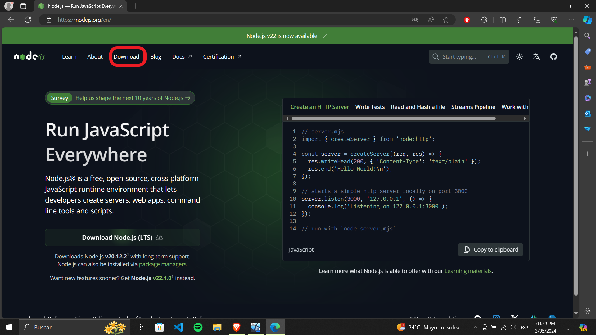
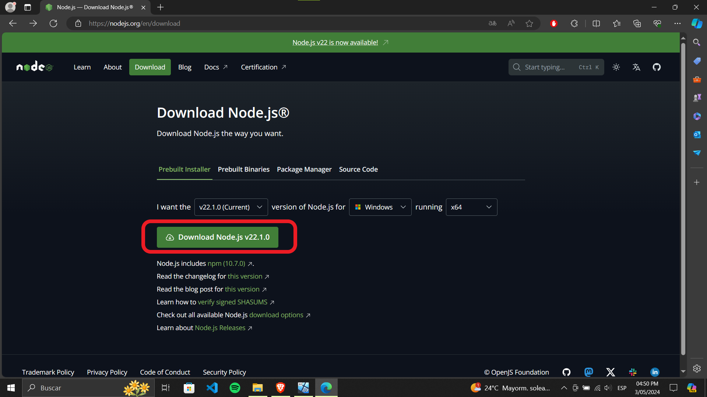
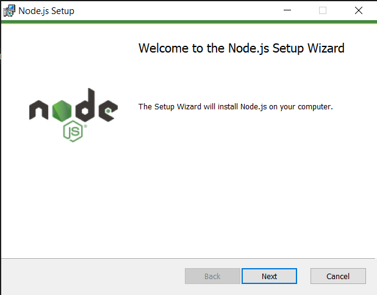
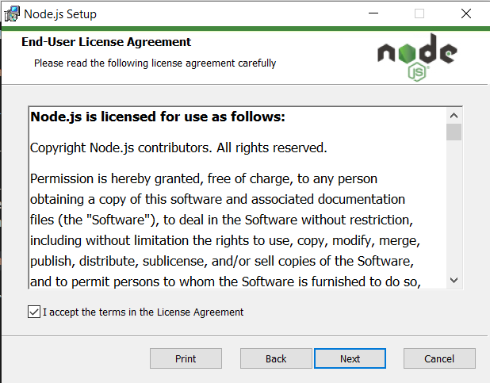
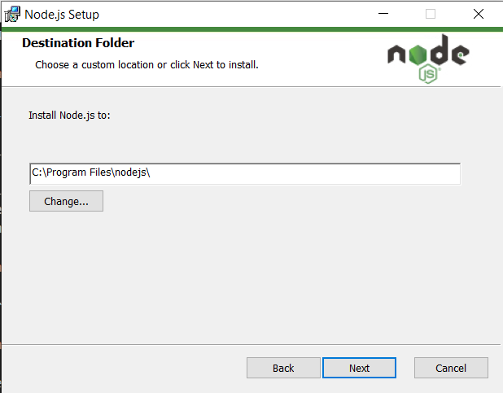
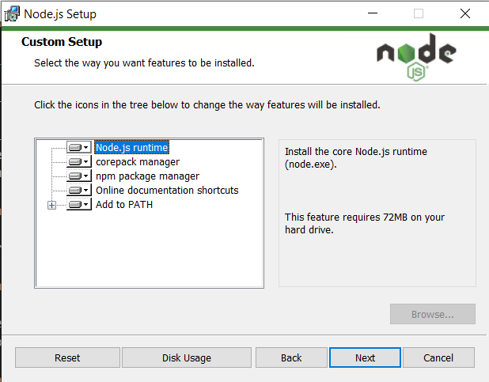
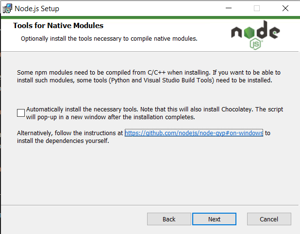
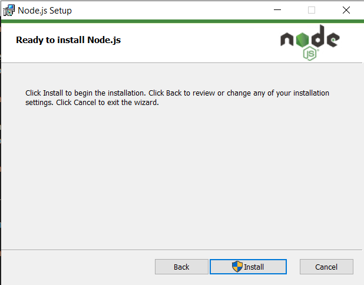
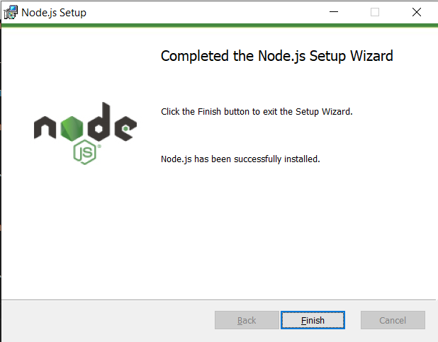

# Procedimiento de instalación de Node JS

<div style="text-align: center;">
   
</div>

---

Node.js es un entorno de tiempo de ejecución de JavaScript de código abierto y multiplataforma que permite ejecutar JavaScript fuera de un navegador web. Utiliza el motor V8 de Google Chrome para ejecutar código JavaScript en el servidor, lo que lo hace rápido y eficiente. Node.js es ampliamente utilizado para la creación de aplicaciones web y de red, ya que permite el desarrollo de aplicaciones de alto rendimiento y escalables. Además, cuenta con un ecosistema de paquetes **npm** (Node Package Manager) que ofrece una amplia variedad de módulos y herramientas para simplificar el desarrollo de aplicaciones.

## Antes de instalar

Antes de instalar **Node.js** debemos tener en cuenta lo siguiente:

1. Tener instalado VS Code
2. Tener privilegios de administrador (caso contrario haz clic [aquí](/Guias/Guia%20de%20instalacion%20nodeJS%20sin%20permisos%20de%20administrador.md)).

## 1. Descargar el instalador

1. Debemos dirigirnos a la página oficial de [Node.js](https://nodejs.org/).

2. En su página principal encontraremos un botón que dice `Download Node.js (LTS)`. Este botón nos descargará una versión estable del programa. Si deseamos acceder a la última versión disponible debemos hacer clic en el apartado de [**Download**](https://nodejs.org/en/download)



3. Una vez estemos en esta página, seleccionaremos la versión marcada como `current`. A la fecha de esta publicación, la versión más reciente es la **22.1.0**. Después, haremos clic en el botón que dice `Download Node.js vXXXX`.



## 2. Ejecutar el instalador

1. Para iniciar la instalación de Node.js, simplemente navega hasta la carpeta donde descargaste el instalador y haz **doble clic** en él. Esto abrirá la ventana del setup, donde simplemente debes hacer `clic en el botón "Next"` para avanzar al siguiente paso del proceso de instalación.

2. Aceptamos los términos y condiciones y hacemos clic en `Next`.





3. Si deseamos, podemos cambiar la ruta en donde se guardará Node.js. De no ser el caso, simplemente démosle en `Next`.



4. Ahora nos dará la opción de hacer una instalación personalizada. Si no deseamos modificar nada hay hacer clic en `Next`.



5. Si deseamos compilar módulos nativos, marcamos la casilla correspondiente. Si no queremos o no estamos seguros de qué significa "compilar módulos nativos", simplemente hacemos clic en `Next`.



6. Nos aparecerá una pantalla adicional para iniciar la instalación. Como se puede observar, el botón `Install` requerirá permisos de administrador.



7. Una vez le demos permisos, nos instalará el programa. La pantalla que debería salir a continuación debería ser parecida a esta:



8. Para finalizar, damos clic a `Finish`.

## 3. Comprobar la instalación

Para realizar este paso debemos [abrir una terminal](https://www.ionos.es/ayuda/correo/solucion-de-problemas-correo-basiccorreo-profesional/abrir-la-linea-de-comandos-terminal/#:~:text=Haga%20clic%20en%20Inicio%20%3E%20Todos,entrada%20con%20la%20tecla%20Enter.)

Una vez abierta escribimos el siguiente comando:

```bash
node -v
```

Si todo ha ido bien, lo que debería aparecer es la versión instalada de Node.js.
