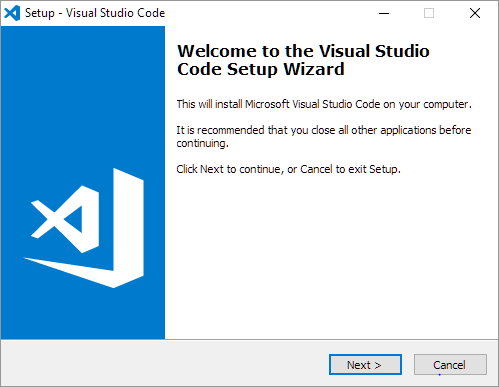

# Procedimiento de Instalación de Visual Studio Code

   

## Paso 1: Descarga de Visual Studio Code

1. Abre tu navegador y dirígete al sitio oficial de Visual Studio Code:
   [Descargar Visual Studio Code](https://code.visualstudio.com/Download)

2. En la página de descarga, selecciona la opción para tu sistema operativo (puedes elegir entre el instalador de sistema o el instalador de usuario según tus preferencias).

## Paso 2: Ejecutar el instalador

1. Una vez que la descarga esté completa, abre el archivo descargado (generalmente en tu carpeta de descargas) que debería llamarse algo como `VSCodeSetup-x64-<version>.exe`.

2. Se abrirá el asistente de instalación. Sigue estos pasos:

- Acepta los términos y condiciones de la licencia.
- Elige la carpeta de destino donde se instalará VS Code (se recomienda dejar la ubicación predeterminada).
- Marca las opciones adicionales según tus necesidades. Por ejemplo:
  - **Add to PATH**: Te permitirá usar `code` en la terminal o línea de comandos para abrir VS Code.
  - **Register Code as an editor for supported file types**: Esto establecerá VS Code como el editor predeterminado para varios tipos de archivo.

3. Haz clic en **Instalar** para comenzar el proceso.

## Paso 3: Finalizar la instalación

1. Una vez que la instalación haya finalizado, puedes elegir la opción de **Lanzar Visual Studio Code** y hacer clic en **Finalizar**.

2. Si no marcaste la opción para abrir VS Code automáticamente, también puedes buscarlo manualmente:
   - Haz clic en el menú de **Inicio** de Windows.
   - Escribe "Visual Studio Code" y selecciona la aplicación.

## Paso 4: Instalar extensiones recomendadas

Una vez que hayas iniciado VS Code, puedes mejorar tu experiencia instalando extensiones. Algunas sugerencias:

- [Flutter Extension](https://marketplace.visualstudio.com/items?itemName=Dart-Code.flutter) para trabajar con Flutter con mayor eficiencia.

- [Error Lens Extension](https://marketplace.visualstudio.com/items?itemName=usernamehw.errorlens) para el análisis de errores a mayor detalle.

Para instalar extensiones:

1. Haz clic en el ícono de extensiones en la barra lateral izquierda de VS Code.
2. Busca las extensiones que deseas y haz clic en **Instalar**.

## Paso 5: Configuración de Git

Si planeas usar **Git** en tus proyectos, también puedes configurarlo dentro de VS Code:

1. Instala [Git](https://git-scm.com/downloads).
2. Después de instalar Git, abre VS Code y asegúrate de que esté detectando Git correctamente.
   - Ve a la pestaña de **Control de Código Fuente** (Source Control) en la barra lateral izquierda.
   - Si ves un mensaje solicitando la instalación de Git, sigue los pasos indicados.

## Enlaces adicionales

- [Documentación oficial de VS Code](https://code.visualstudio.com/docs)
- [Tutoriales para comenzar con VS Code](https://code.visualstudio.com/learn)
