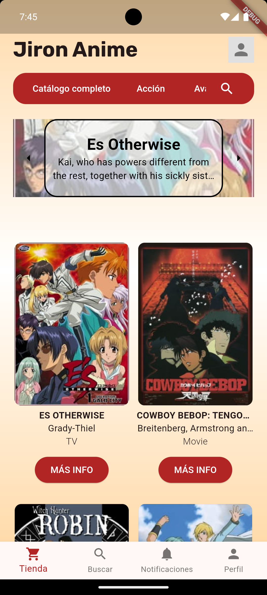
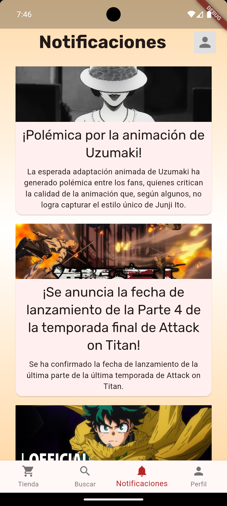
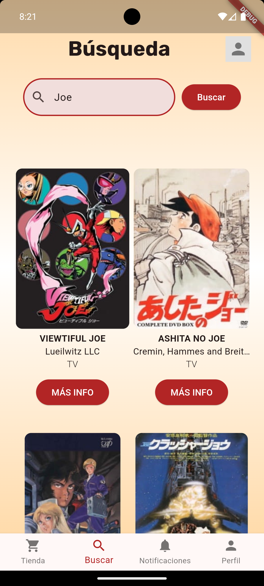
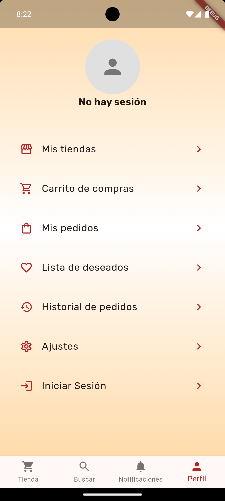

# Proyecto de Programación Móvil 2024-2

Repositorio para el proyecto del curso de Programación Web del ciclo 2024-0 en la carrera de Ingeniería de Sistemas.

  

Grupo 2 - Integrantes:
- Amoretti, Jesu
- Lujan, Cesar
- Romero, Fabrizio
- Alejandro, Chavez
- Juan, Rojas

---

## Jirón Anime (frontend)

Aplicación de e-commerce orientada a productos de cultura anime / pop

### Home (tienda)

### Home (notificaciones)

### Home (búsqueda)

### Home (perfil)

